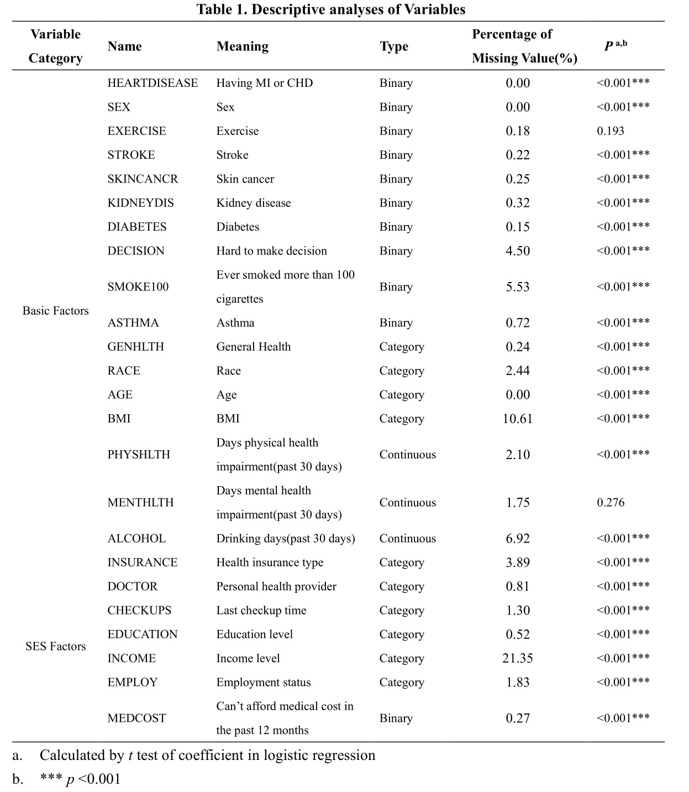

```{r setup, include=FALSE}
knitr::opts_chunk$set(echo = TRUE)
```


\thispagestyle{empty}
\section{Introduction}
\vspace{-0.2cm}
Heart disease is the leading cause of death in the U.S. Main risk factors of heart diseases among Americans including high blood pressure, high cholesterol, smoking, alcohol, and inactivity have been rigorously investigated. In recent years, aside from those physical factors, socioeconomic status(SES) has become a hot topic to determine the risk stratification of several chronic diseases. 

SES is typically represented by income level, employment status, education level, and environmental factors. The discrepancy of SES not only leads to different risk levels of diseases adjusted for other factors but also influences the effect of interventions. For example, the efficacy of behavioral counseling on smoking cessation is more limited among low SES groups than high SES groups, and taking SES markers into account could enhance the precision of risk prediction systems[1]. Though it was shown that heart disease incidence and mortality are higher among middle and low SES groups, the impact of SES on the effects of different risk factors has not been rigorously demonstrated. The dynamic SES under social events (e.g.: COVID-19, economic downturn) also calls for renewal of research findings.

Therefore, in our project, we would like to investigate the influence of SES using 2021’s research data and provide the latest evidence of SES’s function on heart disease risk prediction, which might implicit possible prophylactic steps in different SES groups in America. The computing and visualization codes are in \href{https://github.com/elizabethjchoe/biostat625-group5-project}{625 project} 


\section{Methods}
\vspace{-0.4cm}
\subsection{Dataset}
\vspace{-0.2cm}
The dataset used in our project originates from the Behavioral Risk Factor Surveillance System (BRFSS) of CDC, which includes data of telephone health status surveys across America. The 2021 dataset consists of over 400,000 observations and 279 variables. 22 variables related to heart disease were extracted as subset for analysis in our project: 1) Outcome: the personal reported incidence of heart disease (CHD) or myocardial infarction (MI) was taken as the outcome; 2) SES factors: income level,education level, employment status, and environmental factors about insurance, healthcare provider, and frequency of body check; 3) Confounders: demographic information(age, sex, race), disease history(diabetes, kidney disease, skin disease), life habits(alcohol intake, smoking, exercise), general health indicators(physical/mental health score, BMI). The above variables are renamed for analysis convenience, See original BRFSS variable codes and new codes in \href{https://github.com/elizabethjchoe/biostat625-group5-project}{coding table} and \textbf{Table 1}.

\vspace{-0.4cm}
\subsection{Statistical analyses}
\vspace{-0.2cm}
Statistical analyses were conducted by RStudio, and result visualization were conducted by $ggplot2$, $gtsummary$ and $dplyr$ packages. To begin analysis, since the data was derived from social telephone survey, transformations of variable categories were firstly conducted. Values represent "Refuse","Don’t know/Not Sure", "Not asked or Missing" were treated as missing values. Unordered categorical variables were treated as dummy variables during modeling. 

After transformation, data visualizations were created to show associations between outcome and other variables by conducting logistic regression. Proportions of missing values for each variable are also displayed \textbf{Table 1}, and \textbf{Figure 1} further demonstrated the nonrandom missing pattern for several variables.Since the data set includes unbalanced data, we further explored the distribution of variable values in different categories. We found unbalanced distribution in variable ,,,,, \textbf{Table 1}
{width=50%} 


\vspace{-0.4cm}
\subsection{Data processing}
\vspace{-0.2cm}
1) The nonrandom missing pattern and missing abundance called for imputation. 2) Unbalanced data treatment


\vspace{-0.4cm}
\subsection{Models and Evaluation}
\vspace{-0.2cm}

\section{Results}
\section{Conclusion and Discussion}


\section*{References}
[1] Schultz WM, Kelli HM, Lisko JC, Varghese T, Shen J, Sandesara P, Quyyumi AA, Taylor HA, Gulati M, Harold JG, Mieres JH, Ferdinand KC, Mensah GA, Sperling LS. Socioeconomic Status and Cardiovascular Outcomes: Challenges and Interventions. Circulation. 2018 May 15;137(20):2166-2178. doi: 10.1161/CIRCULATIONAHA.117.029652. PMID: 29760227; PMCID: PMC5958918.

