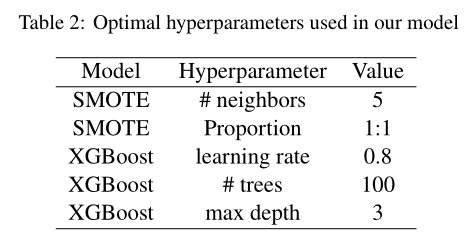

```{r setup, include=FALSE}
knitr::opts_chunk$set(echo = TRUE)
```


\thispagestyle{empty}
\section{Introduction}
\vspace{-0.2cm}
Heart disease is the leading cause of death in the U.S. Main risk factors of heart diseases among Americans including high blood pressure, high cholesterol, smoking, alcohol, and inactivity have been rigorously investigated. In recent years, aside from those physical factors, socioeconomic status(SES) has become a hot topic to determine the risk stratification of several chronic diseases. 

SES is typically represented by income level, employment status, education level, and environmental factors. The discrepancy of SES not only leads to different risk levels of diseases adjusted for other factors but also influences the effect of interventions. For example, the efficacy of behavioral counseling on smoking cessation is more limited among low SES groups than high SES groups, and taking SES markers into account could enhance the precision of risk prediction systems[1]. Though it was shown that heart disease incidence and mortality are higher among middle and low SES groups, the impact of SES on the effects of different risk factors has not been rigorously demonstrated. The dynamic SES under social events (e.g.: COVID-19, economic downturn) also calls for renewal of research findings.

Therefore, in our project, we would like to investigate the influence of SES using 2021’s research data and provide the latest evidence of SES’s function on heart disease risk prediction, which might implicit possible prophylactic steps in different SES groups in America. The computing and visualization codes are in \href{https://github.com/elizabethjchoe/biostat625-group5-project}{625 project} 


\section{Methods}
\vspace{-0.4cm}
\subsection{Dataset}
\vspace{-0.2cm}
The dataset used in our project originates from the Behavioral Risk Factor Surveillance System (BRFSS) of CDC, which includes data of telephone health status surveys across America. The 2021 dataset consists of over 400,000 observations and 279 variables. 22 variables related to heart disease were extracted as subset for analysis in our project: 1) Outcome: the personal reported incidence of heart disease (CHD) or myocardial infarction (MI) was taken as the outcome; 2) SES factors: income level,education level, employment status, and environmental factors about insurance, healthcare provider, and frequency of body check; 3) Confounders: demographic information(age, sex, race), disease history(diabetes, kidney disease, skin disease), life habits(alcohol intake, smoking, exercise), general health indicators(physical/mental health score). The above variables are renamed for analysis convenience, See original BRFSS variable codes and new codes in \href{https://github.com/elizabethjchoe/biostat625-group5-project}{coding table} and \textbf{Table 1}.

\vspace{-0.4cm}
\subsection{Statistical analyses}
\vspace{-0.2cm}
Statistical analyses were conducted by RStudio, and result visualization were conducted by $ggplot2$, $gtsummary$ and $dplyr$ packages. To begin analysis, since the data was derived from social telephone survey, transformations of variable categories were firstly conducted. Values represent "Refuse","Don’t know/Not Sure", "Not asked or Missing" were treated as missing values. Unordered categorical variables were treated as dummy variables during modeling. 

After transformation, data visualizations were created to show associations between outcome and other variables by conducting logistic regression. By investigating the distribution of values in each categories, we also found that there exist unbalanced data in our data set, especially for outcomes (See detailed analysis in  \href{liz/Transformation and descriptive.Rmd}{transformation and descriptive}). Proportions of missing values for each variable are also displayed in \textbf{Table 1}, and \textbf{Figure 1} further demonstrated the nonrandom missing pattern for variables.
{width=50%} 
{width=40%,helght=40%}

\vspace{-0.4cm}
\subsection{Data processing}
\vspace{-0.2cm}
\subsubsection{Missing Values Imputation}
\vspace{-0.4cm}
The nonrandom missing pattern and missing abundance called for imputation.KNN method was applied to conduct imputation.
\vspace{-0.4cm}
\subsubsection{Unbalanced Labels}
\vspace{-0.4cm}
According the statistical analyses, there are 91.8\% (398,735) normal observations and 8.2\% (35,323) observations with heart disease in our dataset. Such unbalanced label pattern would introduce bias when classifying. To be specific, the classifier may pay more attention on the majority label rather than treat two labels equally. Several methods could be utilized to tackle this problem, e.g. assigning different weights to each class, sampling techniques, and changing threshold. Among these methods, a sampling method called Synthetic Minority Oversampling Technique (SMOTE) is broadly used for its simplicity and efficiency without loss of much information. SMOTE is a typical data augmentation technique combining the ideas of both oversampling and undersampling, automatically generates new samples from current dataset. 

\vspace{-0.4cm}
\subsection{Models}
\vspace{-0.2cm}
\subsubsection{Logistic Regression}
\vspace{-0.4cm}
Logistic regression (LR) is a type of generalized linear model, which means that it is a linear model that is used to predict a categorical response. It is called "logistic" because it uses the logistic function to model the probability of an event occurring. The logistic function is a sigmoid curve that maps any input value to a value between 0 and 1. This allows the model to predict the probability that an example belongs to a certain class.  
 
\vspace{-0.6cm}
\subsubsection{XGBoost}
\vspace{-0.4cm}
XGBoost[2] (eXtreme Gradient Boosting) is a powerful and widely-used gradient boosting algorithm in machine learning. Gradient boosting is a machine learning technique that creates a predictive model by adding a sequence of weak learners to an ensemble model. The base models are trained on the residual errors of the previous one, with the goal of minimizing the overall prediction error. XGBoost is an implementation of gradient boosting that is optimized for faster training and higher performance, using techniques such as multi-core CPU parallelization for big data problems. It has also provided a variety of hyperparameters that can be tuned to customize the model's learning process and improve its performance.

\vspace{-0.4cm}
\subsubsection{XGBoost + SparseLR}
\vspace{-0.4cm}
{width=40%,height=40%} 
Typically, the LR model can only handle linear association between the outcome and predictors. It is always time consuming and sometimes subjective to extract features from the original dataset manually. Many researchers have explored various ways to perform an efficient feature engineering. GBDT+LR[3] was a combined machine learning model proposed to process and extract the information in the dataset automatically. To be specific, we firstly train a gradient boosting tree model. For each tree in the ensemble model, every data row is going to fall on one of the leaf nodes, forming a new feature vector. Suppose there are $k$ trees in the model and each tree has $l$ leaf nodes on average. The original $n\times m$ dataset will then be transformed into a $n\times kl$ dataset, with each row as an one-hot vector. Since the new dataset only contains 0 and 1 and most them are 0, we could apply sparse matrix algorithm to accelerate the latter Logistic Regression module. However, there is also some argument about whether the combination of GBDT and LR really outperforms a sole GBDT model. Therefore, we are also doing experiments \footnote{For better implementation in R, we choose XGBoost instead of a vanilla GBDT model.}to compare the result of different models.

\vspace{-0.4cm}
\subsection{Evaluation}
\vspace{-0.2cm}
\subsubsection{Data Split}
\vspace{-0.4cm}
We firstly divide our dataset into the train set (80\%) and the test set (20\%). For all of our models mentioned above, we would use the train dataset to train the model and evaluate it on both sets but mainly focus on the result of the test set.

\vspace{-0.4cm}
\subsubsection{Hyperparameters Searching}
\vspace{-0.4cm}
Note that for SMOTE sampling method and XGBoost model, there are a set of hyperparameters to determine. For example, the number of neighbors chosen $k$ in SMOTE, the number of trees and the nodes of each tree in XGBoost, etc. A feasible solution is to perform a 5-fold cross-validation on train dataset. To be specific, we firstly decide a rough range of the hyperparameters and divide the train dataset into 5 equal subsets. And then we use the four of them to try possible hyperparameters and select the best hyperparameters based on the performance of the rest one subset. The optimal hyperparameters used in our model are listed in table \textbf{Table 2}.

{width=50%} 
{width=40%} 
\vspace{-0.4cm}
\section{Results}
\vspace{-0.2cm}
\subsection{Model evaluation}
\vspace{-0.4cm}
1) LR Coefficients:
For logistic regression model, we use the test set for inference and the full dataset to calculate model Coefficients, e.g. OR (Odds Ratio) and its corresponding p-value. The results are listed in \textbf{Table 3}.
2) XGBoost Vector Influence:
Note that XGBoost, as a boosting ensemble learning strategy, is hard to interpret directly. However, we could calculate the influence value of each factor. In addition, this value would not be affected by the scale of the data.
{width=50%}
3) Model Metrics:
Based on the models and preprocessing methods mentioned above, we calculate different metrics for evaluation. The details are listed in the \textbf{Table 4}.

{width=50%} 
As shown in the table, the XGBoost based model always perform slightly better than LR models. In terms of SMOTE sampling, the F1 score increased drastically on train dataset after using SMOTE. However, the F1 score of test dataset seems to be similar. This may indicate that, sampling-based method is also essentially assigning different weights to two classes, as the distribution of train and test dataset changed as well as the threshold chosen. But there is an advantage of using SMOTE. After using sampling methods, the size of our dataset shrank by 80%, leading to much faster training speed, but remained almost the same result. This indicates that for some large dataset, we could use sampling methods to get a trained model more quickly. Also, note that the performance of XGBoost+LR almost has the same performance with a sole XGBoost model. A possible reason is because the XGBoost model has already learned enough information from the dataset and a LR does not really help to make it better. This result is also consistent to some research mentioned before.

\vspace{-0.4cm}
\subsection{Interpretation}
\vspace{-0.4cm}
As shown in \textbf{Table 3}, except for Exercise (defined by EXERCISE), and mental health( defined by MENTHLTH), all of selected variables showed significant associations with heart disease incidence(P<0.05). SES factors still perform significant effect confounded by other variables. 

Among all of SES factors, employment status and existence of personal health care provider are most influential ones, ranking the first ten risk factors \textbf{Figure 3}. Coefficients showed that people with one personal healthcare provider tend to have 0.78 times of heart disease risk than people without. Different status of employment also leads discrepancy on risk. It was demonstrated that in general trend, less stable employment status are associated with higher risk of heart disease, typically 1.04 times compared with people who have more stable job status. 

Other SES factors, like frequency of routine checkups, insurance, education level, income and recent ability to afford healthcare costs are less powerful. Table \textbf{Table 3} demonstrated that people who have lower level of education and income, less frequency of check ups, less ability to afford the healthcare costs, and lack of health insurance coverage tend to have higher risk for heart disease. 
\vspace{-0.4cm}
\section{Conclusions and Discussion}
\vspace{-0.4cm}
SES factors, including income level, insurance coverage, employment status, education level, and access to medical care in daily lives have significant impact on heart disease risk. We also showed that employment status and existence of personal health care provider have largest influence. As for real world implications, government and health care providers are expected to put more emphasis on SES factors with strong influence, and conduct modification for existed treatment towards traditionally considered risk factors. For example, facilitating family healthcare, focusing on employment status' effects building stratified risk models for area with different SES development level, etc. 

It should also be recognized that SES factors are sometimes related. Stable employment might lead to less depression, guaranteed income, and more regular living habits thus provide prevention for heart disease risk. In further study, subgroup analysis can be performed based on those combinations of SES factors as grouping criteria, to show how SES inequality might impact the effects of traditional risk factors. 

\vspace{-0.6cm}
\subsection*{References}
\vspace{-0.4cm}
[1] Schultz WM, Kelli HM, Lisko JC, Varghese T, Shen J, Sandesara P, Quyyumi AA, Taylor HA, Gulati M, Harold JG, Mieres JH, Ferdinand KC, Mensah GA, Sperling LS. Socioeconomic Status and Cardiovascular Outcomes: Challenges and Interventions. Circulation. 2018 May 15;137(20):2166-2178. doi: 10.1161/CIRCULATIONAHA.117.029652. PMID: 29760227; PMCID: PMC5958918.

[2] Xinran He, Junfeng Pan, Ou Jin, Tianbing Xu, Bo Liu, Tao Xu, Yanxin Shi, Antoine Atallah, Ralf Herbrich, Stuart Bowers, and Joaquin Quiñonero Candela. 2014. Practical Lessons from Predicting Clicks on Ads at Facebook. In Proceedings of the Eighth International Workshop on Data Mining for Online Advertising (ADKDD'14). Association for Computing Machinery, New York, NY, USA, 1–9. https://doi.org/10.1145/2648584.2648589

[3] Tianqi Chen and Carlos Guestrin. 2016. Xgboost: A scalable tree boosting system. In Proceedings of the 22nd ACM SIGKDD International Conference on Knowledge Discovery and Data Mining, KDD ’16, page 785–794, New York, NY, USA. Association for Computing Machinery.
\vspace{-0.4cm}
\subsection*{Notes}
See author contribution in Github README https://github.com/elizabethjchoe/biostat625-group5-project

